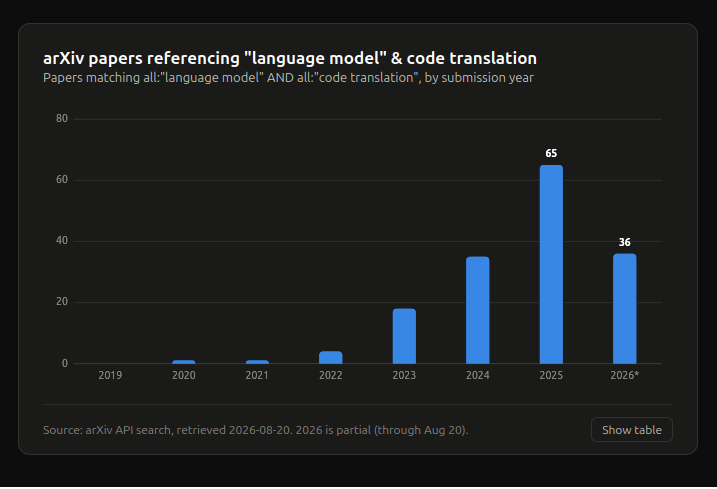
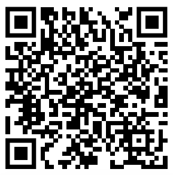

## Today's Talk

 - Brief Introduction (Talk/Stephen/Toby)
 - Background (Collaboration with Clinical Trials Unit)
 - Code Translation Motivation
 - Code Translation Mechanics
 - Workshop Results and Next Steps

## Introduction 

 - Me
 
{fig-alt="Toby at ARC" width="20%"}

## Introduction


## Some Local Images

{fig-alt="Euromast" width="20%"}
{fig-alt="Tornado" width="20%"}
{fig-alt="Erasmus Bridge" width="20%"}
{fig-alt="Maeslant barrier" width="20%"}


## Background
{fig-alt="A screenshot of the Innovative Clinical Trials Unit website" height="280"}

 - World leaders in clinical trial design
 - Robust and tested statistics to support clinician in trial design
 - 2nd Floor of 90HH

## ARC / ICTU Collaboration

 - Multiyear funding for ARC to support ICTU to improve code quality and sharing.
 - Outputs: 
   - "Using Large Language Models and Coding Agents to Translate Stata Packages: Benefits and Risks" [Stata Con, London 4th September]   (https://stata-uk.com/stata-uk-2026.html)
   - "Code Translation using Large Language Models: What's the role of the Research Software Engineer?" [RSE Con, September 2026](https://virtual.oxfordabstracts.com/event/76908/submission/92)

## Motivation - Stata Translation

 - A lot of code is written in Stata
 - Stata is a highly regarded and robust statistical analysis software
 - Publication in Stata journal requires testing/documentation etc.
 - But Stata itself is not opensource and has limited wider impact.
 - Could you increase software impact by translating to other languages?

## Motivation Stata and R

 - R Journal Impact (Scimago Journal Ranking: 0.483) (H-Index 71)
 - Stata Journal Impact (Scimago Journal Ranking: 1.699) (H-Index 123)
 - Stata Language on GitHub 18.4 K ~average 22 stars (median 6) high impact stata packages reghdfe 248 stars, ietoolkit 244
 - R Language on GithHub 1.1 M ~ average 521 start (median 313) 
 - Conclusion - there is likely merit in translation Stata to R.

## Stata2R Practicalities

 - Needs:  
   - Language Expertise (Stata and R)
   - Domain Expertise (Statiisctics)
   - Time (funding)

 - Can we leverage advances in agentic code translation?

## A lot of recent work on code translation using language models.

```{=html}
  <a href="https://stata-translations.github.io/workshop-results/what_they_wanted.html">
    
  </a>
```  

## Writing a Claude Plugin 

  - In this case, the plugin is a collection of skills, defined in markdown

```{=html}
  <a href="https://github.com/stata-translations/Stata2R/tree/main/stata-translation" target="_blank">Link to Stata-translation plugin</a>
```

## Run as an interactive workshop


```{=html}
<a href="https://github.com/stata-translations/Stata2R/blob/main/docs/workshop.md#workshop-format" target="_blank"> The work shop format.</a>
```


## Pre-Workshop Current Roles
```{=html}
<iframe width="100%" height="100%" src="https://stata-translations.github.io/workshop-results/pre-roles.html" title="Answers to survey question on current roles."></iframe>
```


## Pre-Workshop

```{=html}
<iframe width="100%" height="100%" src="https://stata-translations.github.io/workshop-results/pre-roles.html" title="The third blood vessel game."></iframe>
```

## Pre-Workshop

```{=html}
<iframe width="100%" height="100%" src="https://stata-translations.github.io/workshop-results/pre-languages.html" title="The third blood vessel game."></iframe>
```
## Pre-Workshop

```{=html}
<iframe width="100%" height="100%" src="https://stata-translations.github.io/workshop-results/pre-stata_fluency.html" title="The third blood vessel game."></iframe>
```
## Pre-Workshop

```{=html}
<iframe width="100%" height="100%" src="https://stata-translations.github.io/workshop-results/pre-stata-vs-r_fluency.html" title="The third blood vessel game."></iframe>
```
## Pre-Workshop

```{=html}
<iframe width="100%" height="100%" src="https://stata-translations.github.io/workshop-results/pre_expectations.html" title="The third blood vessel game."></iframe>
```

## Post-Workshop


```{=html}
<iframe width="100%" height="100%" src="https://stata-translations.github.io/workshop-results/post_concerns_wordcloud.html" title="The third blood vessel game."></iframe>
```

## Post-Workshop

```{=html}
<iframe width="100%" height="100%" src="https://stata-translations.github.io/workshop-results/post_improvements.html" title="The third blood vessel game."></iframe>
```

## Post-Workshop

```{=html}
<iframe width="100%" height="100%" src="https://stata-translations.github.io/workshop-results/post_model_analysis.html" title="The third blood vessel game."></iframe>
```

## Post-Workshop

```{=html}
<iframe width="100%" height="100%" src="https://stata-translations.github.io/workshop-results/post_model_infrastructure.html" title="The third blood vessel game."></iframe>
```

## Post-Workshop

```{=html}
<iframe width="100%" height="100%" src="https://stata-translations.github.io/workshop-results/post_model_interaction.html" title="The third blood vessel game."></iframe>
```

## Post-Workshop

```{=html}
<iframe width="100%" height="100%" src="https://stata-translations.github.io/workshop-results/post_model_pseudocode.html" title="The third blood vessel game."></iframe>
```

## Post-Workshop

```{=html}
<iframe width="100%" height="100%" src="https://stata-translations.github.io/workshop-results/post_model_reliability.html" title="The third blood vessel game."></iframe>
```

## Post-Workshop

```{=html}
<iframe width="100%" height="100%" src="https://stata-translations.github.io/workshop-results/post_model_target_language.html" title="The third blood vessel game."></iframe>
```

## Post-Workshop

```{=html}
<iframe width="100%" height="100%" src="https://stata-translations.github.io/workshop-results/post_model_testing.html" title="The third blood vessel game."></iframe>
```

## Post-Workshop

```{=html}
<iframe width="100%" height="100%" src="https://stata-translations.github.io/workshop-results/post_model_time.html" title="The third blood vessel game."></iframe>
```

## Post-Workshop

```{=html}
<iframe width="100%" height="100%" src="https://stata-translations.github.io/workshop-results/post_model_vs_effort.html" title="The third blood vessel game."></iframe>
```

## Post-Workshop

```{=html}
<iframe width="100%" height="100%" src="https://stata-translations.github.io/workshop-results/post_workshop_useful.html" title="The third blood vessel game."></iframe>
```

## Workshop Times
| Time | Content |
|------|---------|
| 14:50 to 15:10 | 🍰 Break 🍰 |
| 15:00 | Fire Alarm Test | 

## Workshop Times
| Time | Content |
|------|---------|
| 15:10 to 16:30 | Run translated Code <br> Compare different translations. <br> Assess code translation for post workshop survey. |
| 16:30 to 17:00 | Wrap-up <br> Discussion <br> Fill in [post work shop surveys](https://forms.office.com/Pages/ResponsePage.aspx?id=_oivH5ipW0yTySEKEdmlwkgtFALcEfRKnhSRePBd-9dUQjI1SzdIT1pROVBHVDJSNDU3QUNZVTBGTiQlQCN0PWcu){target="_blank"}. |

## Introduction - [Prerequisites](https://github.com/stata-translations/Stata2R/blob/main/docs/workshop.md#essential){target="_blank"}

 - Claude Code (CLI or Desktop App)
 - Stata
 - R
 - git + github account

## Introduction - Time for Survey

5 minutes to Fill in [Pre Workshop Surveys](https://forms.cloud.microsoft/Pages/ResponsePage.aspx?id=_oivH5ipW0yTySEKEdmlwuNcJ7ofdGhDpRexUha3NYhUMU5QQ000NVpFTVRKRTEzRDRCQ0w4V05XMS4u){target="_blank"}


## Introduction - Claude

[Demo of Claude Code CLI and App.](https://github.com/stata-translations/Stata2R/blob/main/docs/workshop.md#setup-and-installation)


## What's in a plugin
A plugin is a collection of `Skills`

[Plugin Source](https://github.com/stata-translations/Stata2R){target="_blank"}


```md
└── skills
    ├── add-missing-tests
    │   └── SKILL.md
    ├── add-stata-tests-r
    │   └── SKILL.md
    ├── hello
    │   └── SKILL.md
    ├── pseudocode-to-r
    │   ├── assets
    │   ├── references
    │   │   └── language_mappings.md
    │   └── SKILL.md
    ├── run-stata
    │   └── SKILL.md
    ├── stata-to-pseudocode
    │   ├── assets
    │   ├── references
    │   └── SKILL.md
    └── translation-strategy
        ├── assets
        ├── references
        └── SKILL.md

15 directories, 8 files
```

## What's in a Skill
Plain text:
[Plugin Source](https://github.com/stata-translations/Stata2R/blob/main/stata-translation/skills/hello/SKILL.md)

## Pause for questions before we start with translation.

 - Has everyone got a Stata package to work on?
 - Any other questions. 

## Start of interactive Translation Session.

Run through [workshop](https://github.com/stata-translations/Stata2R/blob/main/docs/workshop.md#determine-the-code-translation-strategy){target="_blank"}

Break at 14:50

## Code review and Interactive Running.

We have around 80 minutes to assess the translated code.

 - Can you run the translated code and get equivalent results to Stata?
 - How does your translation compare to other peoples?
 - Work through the questions in the [post work shop survey](https://forms.office.com/Pages/ResponsePage.aspx?id=_oivH5ipW0yTySEKEdmlwkgtFALcEfRKnhSRePBd-9dUQjI1SzdIT1pROVBHVDJSNDU3QUNZVTBGTiQlQCN0PWcu){target="_blank"}. (If you assessed more than one package you can submit multiple results).
 
  {fig-alt="QR Code link to post-workshop survey" height="180"}

## Wrap up and Discussion.

 - Any general questions. 
 - Fill in the [post work shop survey](https://forms.office.com/Pages/ResponsePage.aspx?id=_oivH5ipW0yTySEKEdmlwkgtFALcEfRKnhSRePBd-9dUQjI1SzdIT1pROVBHVDJSNDU3QUNZVTBGTiQlQCN0PWcu){target="_blank"} before leaving if you haven't already done so.
  
  {fig-alt="QR Code link to post-workshop survey" height="180"}
